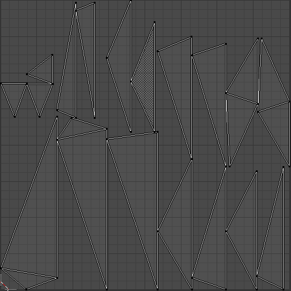
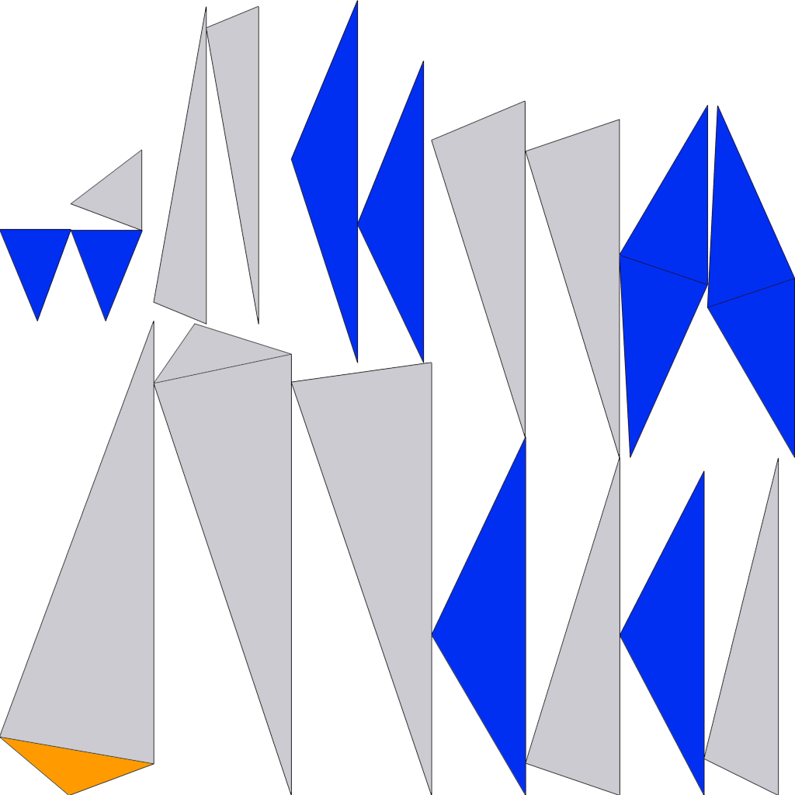
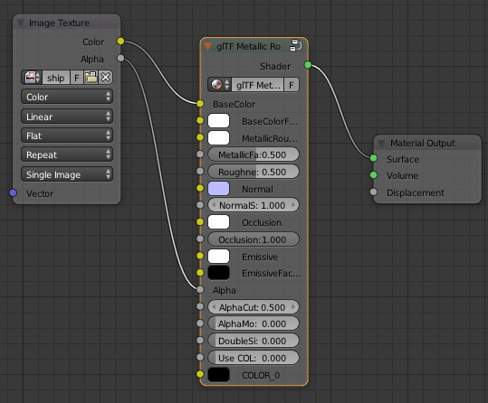

# Project 1
- aka "Hyperspace Cube Glider"

## Technologies Used
- JavaScript, HTML, CSS
- Blender, Photoshop
- THREE.js by MrDoob (version 100)
    - WebGL Library
- GLTF Exporter 2.0 by Khronos Group
    - Used to export ship model with embedded textures
- Node HTTP-Server for development
  - Necessary to circumvent Chrome's cross-origin policy when importing 3D Models.

# Challenges
- Attempting to rapidly develop this project while learning a suite of new technologies and workflows.  This is the first project I've used THREE.js for.

- Writing code for animation loops which wouldn't cause massive errors because it's being run 60 times per second.
    - Ended up writing a lot of code that is "asynchronous" inasmuch that it breaks the normal control flow of the program, but without actual threading.
        - Too much `setTimeout`, not enough callbacks.
# Art Pipeline
1. Export UV Layout for Starship

Blender



2. Import UV to Photoshop and hand-paint texture


3. Reimport texture to Blender and use GLTF Metallic Roughness Shader for Material


4. Final export from Blender as .glb using [glTF Exporter 2.0](https://github.com/KhronosGroup/glTF-Blender-Exporter)


5. Load model to browser using [GLTFLoader](https://threejs.org/docs/#examples/loaders/GLTFLoader) and add it to THREE scene
```javascript
const loader = new THREE.GLTFLoader();
loader.load('models/starship.glb', (gltf) => {
    scene.add(gltf.scene)
})
```

6. Use THREE RenderPass and EffectComposer for real-time post processing
```javascript
const renderScene = new THREE.RenderPass(scene, camera)
const bloomPass = new THREE.UnrealBloomPass(...)
const composer = new THREE.EffectComposer(renderer);
...
composer.addPass(renderScene);
composer.addPass(bloomPass)
```
7. Final call to renderer (happens continuously):
```javascript
composer.render();
```

# Particles / Obstacles Logic
All geometries (aside from ship) are generated procedurally using THREE's `Mesh` class.  In general, all objects in the scene are `Meshes` which are themselves comprised of a `Geometry` object and a `Material` object.
```javascript
mesh = new THREE.Mesh(geometry, material);
scene.add(mesh);
```
The illusion of motion is implemented by incrementing z-positions by velocity, which increases with acceleration.

- +z => closer to near clip (camera) <br>
- -z => closer to far clip (further from camera)
```javascript
const acceleration = 0.001;
let velocity = 0.1;
velocity += acceleration;

for( let particle of particles ) {
    particle.position.z += velocity
}
```
Meshes are 'recycled' when they move behind the camera by giving them a random position closer to the far clip.
This gives the illusion of a continous stream of objects!


## Known Bugs / Unsolved Issues

### Collision Detection
- Due to 8 faulty collisions detected during initialization, player starts with 92% HP.

- Current collision detection logic means that the faster you move, the less damage you take.

## Icebox / Future Plans
- **Refactor code to be object oriented**
    - Use async programming instead of overly liberal applications of  `setTimeout`.
- **Implement lasers**
- Expand collision detection to include other objects besides `obstacles`.
- Add particles on collisions
- Handwrite GLSL vertex and fragment shaders.
